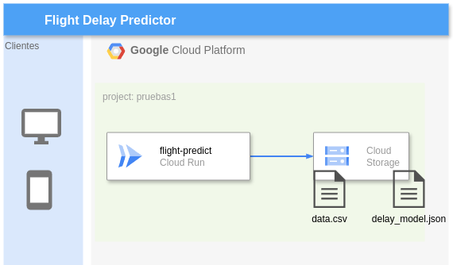
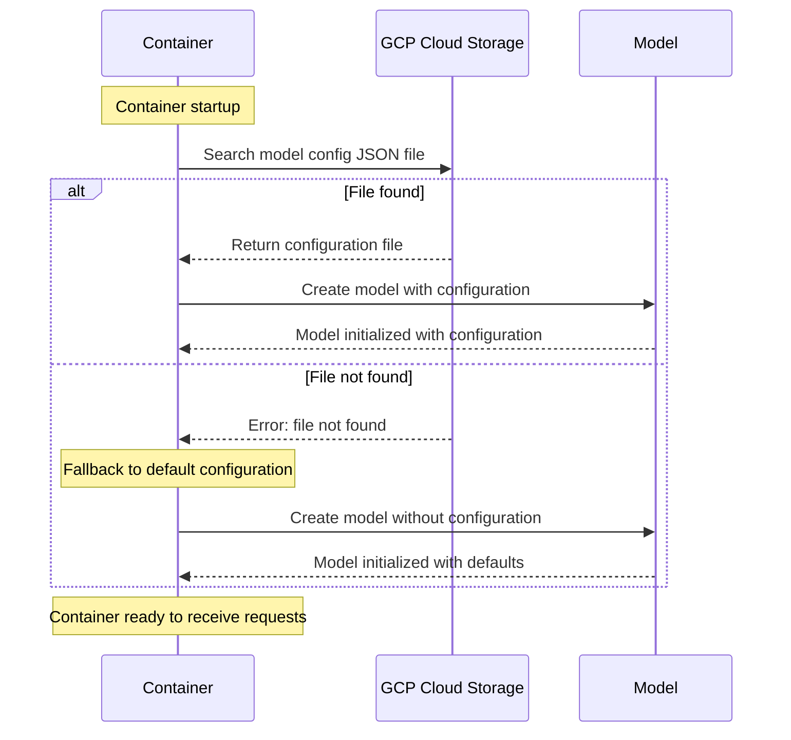
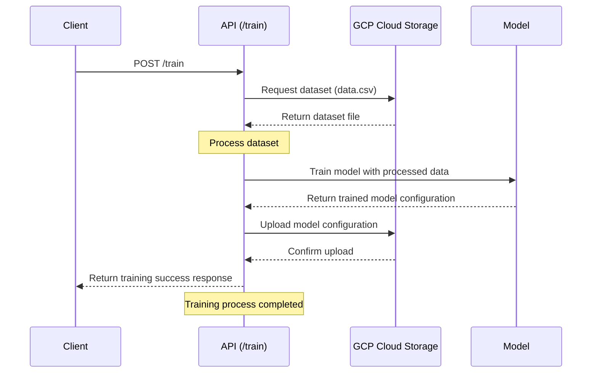

# Flight Delay Predictor

## Model Discussion
In the notebook, the following models were tested:
1. XGBoost
2. Logistic Regression
3. XGBoost with feature importance and balancing
4. XGBoost with feature importance and without balancing
5. Logistic Regression with feature importance and balancing
6. Logistic Regression with feature importance and without balancing

The first two do not take into account the importance of the most relevant features for the dataset. Giving more weight to these features helps improve classification results. Another improvement was testing with data balancing, considering there are many more '0' values in the target than '1' values. Balancing according to the proportion of these values was necessary because before applying it, the recall value was 1.00 for class 0 but 0.00 for class 1, indicating a severe imbalance.

With balancing, more balanced results were obtained for these values.

There was not much difference between the results of XGBoost and Logistic Regression when using balancing, but I consider XGBoost more suitable in this case because it can handle more dimensionality depending on the most relevant features. However, as future work, both models could be implemented, and an environment variable could be used to choose between one or the other.

## Implementation

### Architecture

**Startup**

When this API is started, the container looks for the trained model configuration JSON in a GCP Cloud Storage bucket. If it exists, it is downloaded and the model is initialized with this configuration. Otherwise, the model starts without any training configuration. In that case, you need to call the POST /train method to train the model.

**Training**

Training is done through the /train path and includes the following steps:
1. Retrieve the dataset (data.csv) from a GCP bucket
2. Process the data
3. Train the model
4. Upload the model configuration to a GCP bucket

**Prediction**

To make predictions, the /predict endpoint is used. However, the model must have a training configuration. There are two possible scenarios:
- The training JSON file exists in the GCP bucket so that it is loaded when the container starts.
- The file does not exist, and training is performed via the /train endpoint.

**GCP Bucket Structure**

The bucket has 2 folders:
- **datasets**: Folder where the `data.csv` file required for training is located.
- **model_file**: Folder where the JSON file resulting from model training is stored.

## Deployment

Deployment is done on Cloud Run with the following configurations:
- Invocations without authentication are allowed.
- Environment variables necessary for the API execution are set.
- A livenessProbe is configured to the /health path.

All these deployment configurations are found in the cd.yml file.

## CI/CD

Two files are being used:
- ci.yml
- cd.yml

### Continuous Integration (CI) Workflow

This GitHub Actions file sets up a Continuous Integration pipeline to validate code quality and run automated tests.

**Workflow Triggers**
The workflow runs in the following cases:
- When a push is made to the `develop` branch.
- When a pull request is created toward the `main` or `develop` branches

**Environment Variables**
The workflow uses the following environment variables:
- `BUCKET_NAME`: Name of the Google Cloud Storage bucket containing necessary files
- `MODEL_FILE`: Path to the model file in the bucket
- `DATASET_FILE`: Path to the dataset file in the bucket

**Workflow Steps**

1. **Environment Setup**  
   - Uses Ubuntu as the base operating system  
   - Clones the repository using `actions/checkout@v3`

2. **Google Cloud Setup**  
   - Authenticates with Google Cloud using credentials stored in GitHub secrets  
   - Configures the Google Cloud SDK to access required resources

3. **Python Setup**  
   - Installs Python 3.11  
   - Installs all project dependencies using `make install`

4. **Test Execution**  
   The workflow runs three types of tests:  
   - **Model Tests** (`make model-test`): Validates the prediction model’s functionality  
   - **API Tests** (`make api-test`): Verifies the API endpoints and functionality  
   - **Stress Tests** (`make stress-test`): Assesses system performance and scalability

**Requirements**
For this workflow to function correctly, the following are needed:
- A GitHub secret `GCP_CREDENTIALS` with Google Cloud service account credentials  
- A `Makefile` with the corresponding commands for the tests  
- Access to the specified Google Cloud Storage bucket

**Security Considerations**
- Google Cloud credentials are handled securely through GitHub secrets  
- The workflow only has access to the resources specifically needed for the tests

### Continuous Delivery (CD) Workflow

This GitHub Actions file sets up a Continuous Delivery pipeline to automate the application deployment on Google Cloud Run.

**Workflow Trigger**
The workflow runs only when:
- A push is made to the `main` branch

**Environment Variables**

**GCP Configuration Variables**
- `PROJECT_ID`: Google Cloud project ID (stored in secrets)
- `SERVICE_NAME`: Name of the Cloud Run service
- `REGION`: GCP region where the service is deployed

**Application Variables**
- `LOG_LEVEL`: Logging level for the application
- `THRESHOLD_IN_MINUTES`: Time threshold in minutes
- `BUCKET_NAME`: Name of the storage bucket
- `MODEL_FILE`: Path to the model file
- `DATASET_FILE`: Path to the dataset file

**Workflow Steps**

1. **Environment Preparation**
   - Uses Ubuntu as the base operating system
   - Clones the repository using `actions/checkout@v3`

2. **Google Cloud Setup**
   - Authenticates with Google Cloud using credentials stored in secrets
   - Configures the Google Cloud SDK to access services

3. **Docker Image Build and Push**
   - Builds the Docker image using Cloud Build
   - Tags the image with the commit SHA for versioning
   - Stores the image in Google Container Registry

4. **Deployment on Cloud Run**
   Configures the service with:
   - The managed platform of Cloud Run
   - Public access (`--allow-unauthenticated`)
   - The necessary environment variables for the application
   - The specified region for deployment